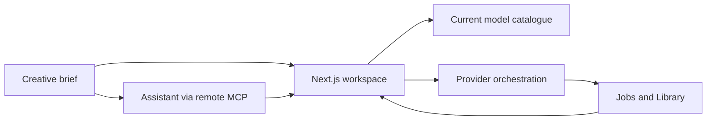

<p align="center"></p>

# MaxVideoAI

**Multi-model AI video production**

MaxVideoAI is a multi-model AI video production platform for planning, comparing, pricing, generating, and organizing video work in one place. Bring a brief, choose among current model options, review the price before generation, and keep finished results and reusable references together in your MaxVideoAI Library.

[Try MaxVideoAI](https://maxvideoai.com/app) · [Explore models](https://maxvideoai.com/models) · [Use MaxVideoAI from ChatGPT, Claude & Codex](https://maxvideoai.com/mcp)

[Plugin repository preview — release pending](https://github.com/camgraphe/maxvideoai-plugin)


*Current MaxVideoAI web-product proof. The editorial frame is decorative; this image does not claim a verified native flow inside ChatGPT, Claude, or Codex.*

## What can you make with MaxVideoAI?

Turn a single prompt or supported media reference into a shot, build a coherent sequence, or explore several creative directions before committing spend. The workspace brings generation controls, outputs, and the Library into one production path, so the useful work does not vanish when an experiment ends.

| Production goal | MaxVideoAI path |
| --- | --- |
| Explore a visual direction | Test a prompt or supported reference with settings matched to the chosen workflow. |
| Build a multi-shot project | Plan shots, compare model fit, and keep the creative brief visible across iterations. |
| Control production spend | Check current pricing and review the generation price before launching paid work. |
| Reuse finished work | Recover outputs and media from the MaxVideoAI Library for the next step. |

See current prompts and outputs in the [examples gallery](https://maxvideoai.com/examples), or bring your own brief. It is usually the more interesting place to start.

## How do you compare current AI video models?

MaxVideoAI lets creators compare current AI video models by capability, workflow, settings, and price before choosing a production route. Model families such as Sora, Veo, Kling, Seedance, and LTX are examples—not a fixed catalogue. Use the [live model directory](https://maxvideoai.com/models) for current availability and pricing.


The image proves the current MaxVideoAI selector and completed result. It does not prove a model ranking, budget, quote, approval, or native assistant-host execution.

| Start with | Compare for |
| --- | --- |
| A text brief | Motion style, prompt control, duration, aspect ratio, and supported output options. |
| An image or video reference | Reference type, framing control, continuity, and workflow-specific constraints. |
| A sequence of shots | Visual consistency, turnaround needs, and an intentional model mix versus one-model continuity. |

## How do project pricing and approval work?

Current price information belongs beside the current model and settings—not frozen in a README. MaxVideoAI exposes the generation price before paid work begins. In the assistant workflow, a prepared request returns an exact quote and requires explicit approval for one paid attempt; planning and comparisons do not silently authorize generation.

1. Choose the model, mode, duration, resolution, and supported extras.
2. Review the current price or [project pricing](https://maxvideoai.com/pricing) before generation.
3. Launch the web request, or explicitly approve the prepared assistant request when the production is ready.

> You stay in control of the spend. A changed request needs a fresh price, and an interrupted assistant response should be recovered before another paid attempt is considered.

## How do references and continuity work?

Supported workflows can use image, video, or audio references to preserve framing, subject, motion, or sound direction. Reference support depends on the selected model and mode, so the live composer remains the source of truth. Completed work and reusable media stay connected through the MaxVideoAI Library.


This current production composite proves that the same completed result continues from the MaxVideoAI workspace into the Library. It does not depict a verified brief, quote, approval, private upload, or native host flow.

Pick up where the production left off: open the [Library](https://maxvideoai.com/app/library), review the saved result, and reuse only the media that belongs in the next request.

## Can ChatGPT, Claude, and Codex use MaxVideoAI?

MaxVideoAI exposes a remote MCP service and a checked-in plugin package for assistant-led planning and generation workflows. The package includes setup guides, model-planning and generation skills, privacy boundaries, examples, and recovery guidance. Its dedicated public distribution repository remains a preview until the first release lands.

[Read the active product setup](https://maxvideoai.com/mcp) · [Inspect the source package](plugins/maxvideoai) · [Public repository preview — release pending](https://github.com/camgraphe/maxvideoai-plugin)

Platform availability and setup can change. Follow the guide for your ChatGPT, Claude, Codex, or compatible MCP surface and treat the linked compatibility evidence as current only for the state it documents. The product proof in this README is MaxVideoAI web-app proof, not native host proof.

```text
Brief → compare current models → prepare exact request → review price → approve one attempt → recover result
```

The assistant path uses the connected MaxVideoAI account, credits, and Library. It does not require a separate plugin subscription; paid generations still use the product's current pay-as-you-go pricing.

## How is MaxVideoAI built?

The public application is a production Next.js system with a capability-driven model catalogue, server-owned provider orchestration, billing controls, a media Library, localized marketing surfaces, and remote MCP integration.



| Area | Repository owner |
| --- | --- |
| Routes, layouts, and UI | [`frontend/app`](frontend/app) and [`frontend/components`](frontend/components) |
| Pure product and SEO logic | [`frontend/lib`](frontend/lib) |
| Server orchestration | [`frontend/server`](frontend/server) and [`frontend/src/server`](frontend/src/server) |
| Model identity and policy | [`frontend/config/model-registry.json`](frontend/config/model-registry.json) |
| Public assistant package | [`plugins/maxvideoai`](plugins/maxvideoai) |
| Application migrations | [`neon/migrations`](neon/migrations) |

Supabase owns authentication, Neon owns relational application data, and Amazon S3 owns media bytes. See the [environment reference](docs/engineering/environment-reference.md) for the operational boundary.

## Local development

The shortest contributor path uses the repository-pinned pnpm version and Node.js 22:

```bash
pnpm install
cp frontend/.env.local.example frontend/.env.local
pnpm dev
```

Read [local development](docs/engineering/local-development.md) for the frontend, legacy mock contract server, Docker, model onboarding, migrations, scheduled jobs, and validation commands. Read the [environment reference](docs/engineering/environment-reference.md) for variables, health endpoints, and data ownership.

Before changing architecture or model policy, start with [`AGENTS.md`](AGENTS.md), the [LLM working guide](docs/engineering/llm-working-guide.md), and the closest area-specific instructions.

## Contributing, security, and license

Contributions are welcome when they preserve the product contracts, public URLs, model-registry ownership, and server/client boundaries documented in the engineering guides.

| Need | Start here |
| --- | --- |
| Propose or implement a change | [`CONTRIBUTING.md`](CONTRIBUTING.md) |
| Report a vulnerability privately | Email [security@maxvideoai.com](mailto:security@maxvideoai.com); do not open a public issue. |
| Ask for product or repository help | [Contact MaxVideoAI](https://maxvideoai.com/contact) |
| Review public/private boundaries | [`docs/public-vs-private.md`](docs/public-vs-private.md) |

The repository uses the [Business Source License 1.1](LICENSE), with the terms and change date defined in the license file. Commercial deployments require a separate licence; see the [dual-license guide](docs/licensing/dual-license.md), email [licensing@maxvideo.ai](mailto:licensing@maxvideo.ai), and review [`NOTICE`](NOTICE).

Last reviewed: 2026-08-28.
