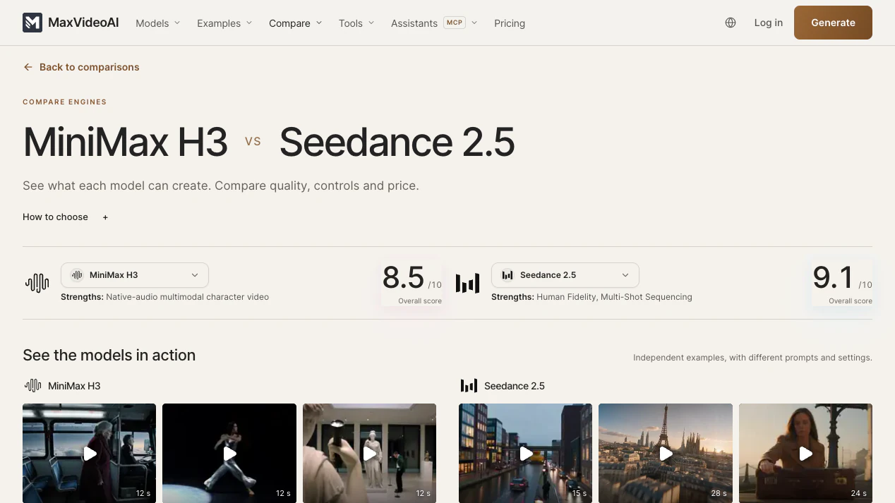
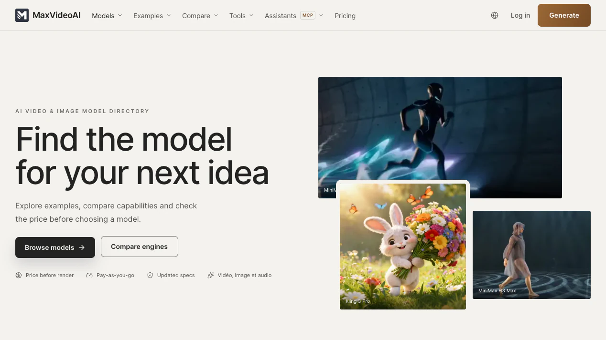
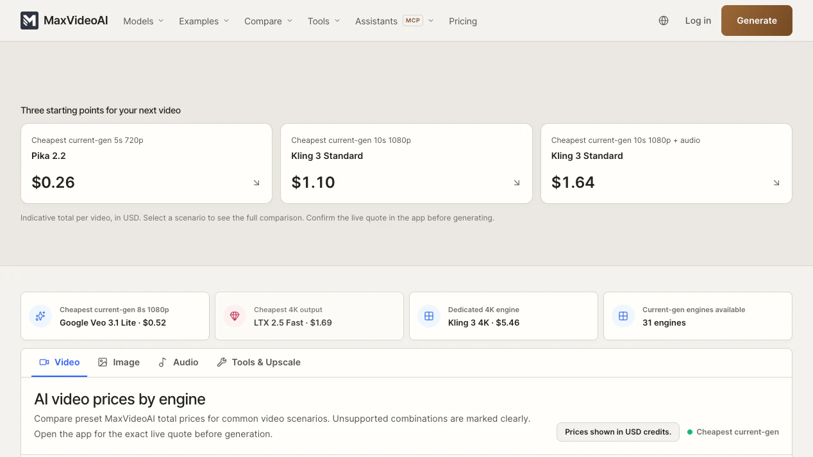
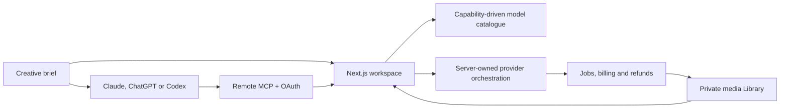

<p align="center"></p>

# MaxVideoAI

**Compare AI video models. Know the price. Create in one workspace.**

MaxVideoAI is a multi-model AI video production platform for turning a brief into finished, reusable work. Explore real examples, compare current engines side by side, review model capabilities and pricing, generate video, image, or audio, and keep outputs and references together in the MaxVideoAI Library.

[Plan a video with MaxVideoAI](https://maxvideoai.com/mcp?utm_source=github&utm_medium=repository&utm_campaign=maxvideoai_product&utm_content=hero_try) · [Compare current models](https://maxvideoai.com/models?utm_source=github&utm_medium=repository&utm_campaign=maxvideoai_product&utm_content=models) · [Use MaxVideoAI from Claude, ChatGPT or Codex](https://maxvideoai.com/mcp?utm_source=github&utm_medium=repository&utm_campaign=maxvideoai_product&utm_content=plugin_callout)

[Plugin repository](https://github.com/camgraphe/maxvideoai-plugin) · [Plugin releases](https://github.com/camgraphe/maxvideoai-plugin/releases)


## What does the MaxVideoAI workspace bring together?

MaxVideoAI brings model choice, prompts, references, settings, live pricing, previews, results, and next-shot context into one production workspace. That workspace is the main product; the GitHub plugin extends the same production path to Claude, ChatGPT, and Codex later in this page.


*The current public workspace, captured from production on August 29, 2026.*

## What can you make with MaxVideoAI?

Use MaxVideoAI to develop a single shot, animate an image, build a multi-shot sequence, create supporting images or audio, and continue from earlier work. The workspace keeps model selection, prompts, references, settings, price, previews, results, and the Library in one production path instead of scattering them across provider tabs.


Every public example opens into its prompt, settings, model, duration, and recorded render cost. Browse the [AI video examples gallery](https://maxvideoai.com/examples), then recreate a useful starting point in your own workspace.

| Production goal | Start here |
| --- | --- |
| Find a visual direction | Preview varied examples and inspect the prompt and settings behind them. |
| Build with references | Choose a workflow that supports the image, video, or audio material you want to use. |
| Plan several shots | Keep one brief visible while comparing a consistent route with an intentional model mix. |
| Continue finished work | Recover outputs and reusable media from the MaxVideoAI Library. |

## How do you compare current AI video models?

MaxVideoAI compares AI video engines by workflow, supported inputs, duration, resolution, audio, pricing, strengths, and a documented editorial score. The side-by-side hub is designed for an actual production decision: choose two engines, inspect the trade-offs, open the detailed matchup, and move to the model that fits the shot.



The broader [model directory](https://maxvideoai.com/models) adds recommended starting points and routes for video, image, audio, and preparation work.



Model families such as Sora, Veo, Kling, Seedance, LTX, MiniMax, Wan, and Pika are examples rather than a frozen catalogue. Use the live directory for current availability and pricing.

## How do project pricing and approval work?

MaxVideoAI is pay as you go. The pricing surface compares common scenarios across video, image, audio, and production tools, while the workspace shows the live price for the selected request before launch. In the assistant workflow, a concrete request becomes an exact quote and one explicit approval authorizes one paid attempt.



1. Choose the model, mode, duration, resolution, and supported extras.
2. Compare the current [AI video pricing](https://maxvideoai.com/pricing).
3. Review the live workspace price or assistant quote.
4. Launch from the web app, or explicitly approve one prepared assistant attempt.

## How do references and continuity work?

Supported workflows can use image, video, or audio references for composition, subject, motion, timing, or sound direction. The selected model and mode determine the accepted reference roles and limits. Finished results and reusable assets remain in the connected MaxVideoAI Library, ready for the next shot or another production route.


[Open the Library](https://maxvideoai.com/app/library) to browse saved media and continue where the production stopped.

## Can Claude, ChatGPT or Codex use MaxVideoAI?

Yes. MaxVideoAI exposes one remote MCP production service with three equal entry points: a Claude connector or plugin, a ChatGPT app/plugin path, and a Codex plugin. The connected assistant can help shape the brief, compare current model options, calculate project budgets, prepare an exact quote, wait for approval, and recover the accepted result in the same MaxVideoAI account.


[Claude setup](plugins/maxvideoai/docs/claude.md) · [ChatGPT setup](plugins/maxvideoai/docs/chatgpt.md) · [Codex setup](plugins/maxvideoai/docs/codex.md) · [MCP technical reference](https://maxvideoai.com/docs/mcp) · [Public plugin source](https://github.com/camgraphe/maxvideoai-plugin)

```text
Brief → compare models → budget shots → prepare exact quote → approve one attempt → recover result
```

The focused [plugin repository](https://github.com/camgraphe/maxvideoai-plugin) carries tagged, checksum-backed releases. Use its release page for the current installable package; this product repository remains the authored source of the application and plugin bundle.

## How is MaxVideoAI built?

This repository contains the production application, its public marketing and comparison surfaces, provider orchestration, billing controls, media workflows, model registry, remote MCP server, and the distributable MaxVideoAI plugin package.



| Layer | Technology and ownership |
| --- | --- |
| Web product | Next.js App Router, React, TypeScript, Tailwind CSS |
| Authentication | Supabase Auth |
| Application data | Neon Postgres |
| Media storage | Amazon S3 |
| Billing | Stripe and server-owned price/approval controls |
| Model execution | Capability-driven registry plus provider adapters owned by the server |
| Assistant integration | Remote Streamable HTTP MCP, OAuth, checked-in Claude/Codex manifests and skills |
| Quality | Node test contracts, Playwright browser checks, lint, typecheck, exposure and asset gates |

| Repository area | Responsibility |
| --- | --- |
| [`frontend/app`](frontend/app) | Routes, layouts, metadata, APIs, and route orchestration |
| [`frontend/components`](frontend/components) | Shared product and marketing UI |
| [`frontend/lib`](frontend/lib) | Browser-safe product, pricing, routing, and SEO logic |
| [`frontend/server`](frontend/server) and [`frontend/src/server`](frontend/src/server) | Server orchestration, providers, jobs, billing, and MCP |
| [`frontend/config/model-registry.json`](frontend/config/model-registry.json) | Authored model identity and publication policy |
| [`plugins/maxvideoai`](plugins/maxvideoai) | Public plugin package, skills, host guides, examples, and release assets |
| [`neon/migrations`](neon/migrations) | Application database migrations |

Read the [project structure](docs/engineering/project-structure.md), [model registry workflow](docs/engineering/model-registry.md), [MCP mode coverage](docs/engineering/mcp-mode-coverage.md), and [private reference-import boundaries](docs/engineering/mcp-reference-imports.md) before changing those contracts.

## Local development

The contributor path uses Node.js 22 and the repository-pinned pnpm version:

```bash
pnpm install
cp frontend/.env.local.example frontend/.env.local
pnpm dev
```

Focused validation for public GitHub and plugin work:

```bash
pnpm github:content:check
pnpm github:assets:check
pnpm github:score -- --require-after
npm run lint:exposure
git diff --check
```

Read [local development](docs/engineering/local-development.md) for the frontend, contract server, Docker, migrations, model onboarding, scheduled jobs, and validation commands. The [environment reference](docs/engineering/environment-reference.md) documents variables, health endpoints, and the Supabase/Neon/S3 ownership boundary.

Before an architecture or model-policy change, start with [`AGENTS.md`](AGENTS.md), the [LLM working guide](docs/engineering/llm-working-guide.md), and the closest area-specific instructions.

## Contributing, security, and license

Small, reviewable contributions are welcome when they preserve public URLs, the authored model registry, server/client boundaries, private-media handling, and the evidence contracts that keep public claims accurate.

| Need | Start here |
| --- | --- |
| Propose or implement a change | [`CONTRIBUTING.md`](CONTRIBUTING.md) |
| Report a vulnerability privately | Email [security@maxvideoai.com](mailto:security@maxvideoai.com); do not open a public issue. |
| Ask for product or repository help | [Contact MaxVideoAI](https://maxvideoai.com/contact) |
| Review public/private boundaries | [`docs/public-vs-private.md`](docs/public-vs-private.md) |

The repository uses the [Business Source License 1.1](LICENSE), with its terms and change date defined in the license file. Commercial deployments require a separate licence; see the [dual-license guide](docs/licensing/dual-license.md), email [licensing@maxvideo.ai](mailto:licensing@maxvideo.ai), and review [`NOTICE`](NOTICE).

Last reviewed: 2026-08-29.
