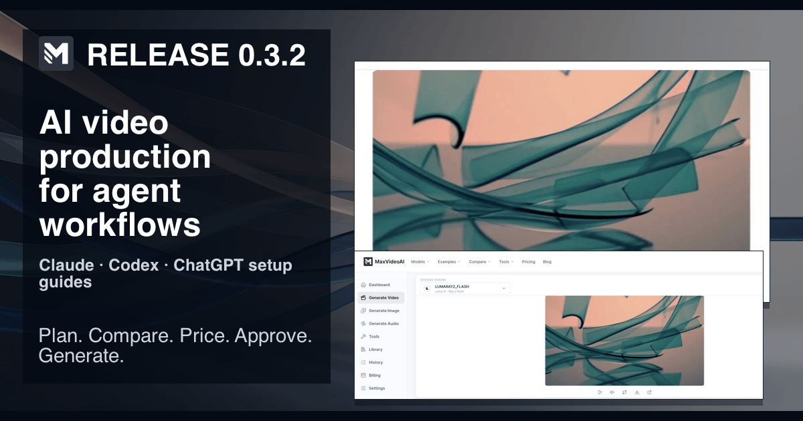

# MaxVideoAI GitHub editorial calendar

This is an eight-week, proof-led publication queue. It contains the twelve named launch units and four substantive evidence follow-ups, not four unchanged reposts. Every entry needs its gate checked again at publication time; a calendar slot does not authorize a claim.

**Shared source of truth:** [MaxVideoAI proof asset manifest](https://github.com/camgraphe/MaxVideoAi/blob/main/docs/marketing/github-asset-manifest.json), [compatibility evidence](https://maxvideoai.com/docs/mcp), and the checked-in platform guides. The proof images below show MaxVideoAI product state, not native ChatGPT, Claude, or Codex execution.

## Week 1: bring the brief

### Unit 01: AI video production inside ChatGPT, Claude, and Codex

**Rhythm:** Outcome/proof. **Owner:** Growth + MCP Engineering. **Human search question:** How can I plan an AI video without losing my brief across tools? **Agent question:** Which MaxVideoAI workflow should I use before a paid generation? **Direct answer:** Bring one brief to MaxVideoAI, compare current options, then keep the result and references in its Library.

**Proof visual:** `readme-proof-hero.webp`; it proves a current MaxVideoAI workspace result, not a named-host run. **First-party MaxVideoAI fact or workflow:** plan → compare → prepare → exact quote → explicit approval → one paid attempt → Library recovery. **Source URL:** https://github.com/camgraphe/MaxVideoAi/blob/main/plugins/maxvideoai/README.md. **GitHub surface:** repository README launch section. **Website counterpart:** https://maxvideoai.com/mcp. **Outreach class:** maintained AI-agent workflow resource. **Canonical backlink:** https://maxvideoai.com/mcp. **CTA:** Read the setup path for your surface, then start with a no-spend plan. **Publication gate:** current endpoint, OAuth, platform wording, and proof-manifest review. **Refresh trigger:** host setup or workspace proof changes. **Measurement:** README-to-guide referrals and no-spend plan starts.

### Unit 02: One brief, three model routes: quality, control, and cost

**Rhythm:** Decision/trust. **Owner:** Model Catalog + Growth. **Human search question:** How should I choose a video model for one brief? **Agent question:** Compare executable model routes without declaring a universal winner. **Direct answer:** Turn one brief into named quality-, control-, and cost-oriented routes, then choose the trade-off that fits the shot.

**Proof visual:** `model-choice-and-budget.webp`; it proves a current selector and result, not pricing or a recommendation outcome. **First-party MaxVideoAI fact or workflow:** planning uses current model facts and named project budgets before a paid request. **Source URL:** https://github.com/camgraphe/MaxVideoAi/blob/main/plugins/maxvideoai/examples/creator-budget-comparison.md. **GitHub surface:** `examples/compare-ai-video-models.md`. **Website counterpart:** https://maxvideoai.com/models. **Outreach class:** AI-video comparison resource. **Canonical backlink:** https://maxvideoai.com/models. **CTA:** Copy the comparison prompt and keep generation unprepared. **Publication gate:** catalog and capability wording checked against the live public model facts. **Refresh trigger:** model roster, capability, or availability change. **Measurement:** example opens and model-page referrals.

## Week 2: price before commitment

### Unit 03: How to price an AI video project before generating

**Rhythm:** Outcome/proof. **Owner:** Pricing + Growth. **Human search question:** Can I price an AI video project before I generate? **Agent question:** Produce comparable project budgets without authorizing spend. **Direct answer:** Use planning to compare named project budgets, then request an exact quote only when the concrete shot is ready.

**Proof visual:** `model-choice-and-budget.webp`; it does not prove a price, quote, or approval. **First-party MaxVideoAI fact or workflow:** a project budget informs a choice; the prepared request returns the exact quote. **Source URL:** https://github.com/camgraphe/MaxVideoAi/blob/main/plugins/maxvideoai/README.md. **GitHub surface:** `examples/price-a-video-project.md`. **Website counterpart:** https://maxvideoai.com/pricing. **Outreach class:** creator budgeting guide. **Canonical backlink:** https://maxvideoai.com/pricing. **CTA:** Price the brief first; do not approve a generation yet. **Publication gate:** pricing boundary and wording reviewed by Billing. **Refresh trigger:** quote flow or pricing page change. **Measurement:** pricing referrals and quote-preparation conversion.

### Unit 04: Claude workflow: brief → plan → exact quote → approval → result

**Rhythm:** Decision/trust. **Owner:** MCP Engineering + Developer Relations. **Human search question:** What is the safe Claude workflow for an AI video request? **Agent question:** Explain the no-spend-to-paid boundary without claiming universal Claude support. **Direct answer:** In an eligible Claude setup, start with a no-spend plan and treat explicit approval of an exact quote as one paid attempt.

**Proof visual:** `brief-to-video-workflow.webp`; it proves MaxVideoAI result-to-Library continuity, not a native Claude flow. **First-party MaxVideoAI fact or workflow:** browser OAuth connects the account you choose; a lost response should lead to accepted-job recovery before another request. **Source URL:** https://github.com/camgraphe/MaxVideoAi/blob/main/plugins/maxvideoai/docs/claude.md. **GitHub surface:** `docs/claude.md` and `examples/claude-video-production.md`. **Website counterpart:** https://maxvideoai.com/docs/mcp. **Outreach class:** maintained Claude workflow guide. **Canonical backlink:** https://maxvideoai.com/docs/mcp. **CTA:** Validate with the no-spend Claude prompt in your account. **Publication gate:** current Claude documentation and local host wording rechecked. **Refresh trigger:** Claude connector policy or UI change. **Measurement:** Claude-guide referrals and safe-plan completions.

## Week 3: make the recovery boundary legible

### Unit 05: Codex workflow: install → compare → budget → generate → recover

**Rhythm:** Outcome/proof. **Owner:** Plugin Release Owner + Developer Relations. **Human search question:** How do I use the MaxVideoAI Codex package safely? **Agent question:** What is the checked-in Codex package path and recovery sequence? **Direct answer:** Install the reviewed package, use `$plan` before spending, and recover an accepted job rather than sending a duplicate paid request.

**Proof visual:** `readme-proof-hero.webp`; it proves current MaxVideoAI product state, not native Codex execution. **First-party MaxVideoAI fact or workflow:** the package path is checked in; first live action opens browser OAuth, and approval authorizes one attempt. **Source URL:** https://github.com/camgraphe/MaxVideoAi/blob/main/plugins/maxvideoai/docs/codex.md. **GitHub surface:** `docs/codex.md` and `examples/codex-video-production.md`. **Website counterpart:** https://maxvideoai.com/docs/mcp. **Outreach class:** Codex plugin workflow resource. **Canonical backlink:** https://maxvideoai.com/docs/mcp. **CTA:** Install the tagged package, then ask for a no-spend comparison. **Publication gate:** release tag, package metadata, command, and support path verified. **Refresh trigger:** package tag or Codex installation behavior changes. **Measurement:** package installs, guide referrals, and `$plan` discovery reports.

### Unit 06: What “price before generation” protects

**Rhythm:** Decision/trust. **Owner:** Billing + Trust. **Human search question:** Why should I ask for a price before generating AI video? **Agent question:** Explain the exact-quote approval boundary in operational terms. **Direct answer:** A displayed project budget guides selection, while an exact quote plus explicit approval prevents an ambiguous reply from starting paid work.

**Proof visual:** `library-continuity.webp`; it proves Library continuity only, not a quote or approval event. **First-party MaxVideoAI fact or workflow:** one approval authorizes exactly one paid attempt; a replacement requires a fresh quote and new explicit approval. **Source URL:** https://github.com/camgraphe/MaxVideoAi/blob/main/plugins/maxvideoai/docs/how-it-works.md. **GitHub surface:** release discussion or README trust section. **Website counterpart:** https://maxvideoai.com/pricing. **Outreach class:** responsible-AI purchasing explainer. **Canonical backlink:** https://maxvideoai.com/pricing. **CTA:** Compare budgets before preparing the exact request. **Publication gate:** Billing validates the current quote and refund language. **Refresh trigger:** approval, quote, or refund-policy change. **Measurement:** pricing-guide exits to quote preparation and duplicate-attempt support rate.

## Week 4: preserve work and references

### Unit 07: Recover a finished generation after the conversation is interrupted

**Rhythm:** Outcome/proof. **Owner:** Support + Generation. **Human search question:** How do I recover an AI video after a chat is interrupted? **Agent question:** Recover the accepted job before creating another paid request. **Direct answer:** Check the accepted job or recent generations first; the completed result or refunded outcome remains the evidence for the next move.

**Proof visual:** `brief-to-video-workflow.webp`; it proves a completed result can continue to the Library, not native-host recovery. **First-party MaxVideoAI fact or workflow:** a refunded attempt closes its authorization; replacement work needs a new quote and approval. **Source URL:** https://github.com/camgraphe/MaxVideoAi/blob/main/plugins/maxvideoai/examples/recover-a-generation.md. **GitHub surface:** `examples/recover-a-generation.md` follow-up. **Website counterpart:** https://maxvideoai.com/app/library. **Outreach class:** creator recovery workflow. **Canonical backlink:** https://maxvideoai.com/app/library. **CTA:** Recover the accepted job before asking for another paid attempt. **Publication gate:** recovery and refund wording checked against support guidance. **Refresh trigger:** Library or job-status flow changes. **Measurement:** recovery-example referrals and duplicate-generation support contacts.

### Unit 08: Use reference images and video without losing account continuity

**Rhythm:** Decision/trust. **Owner:** Media + Trust. **Human search question:** How can I use private references without exposing them in chat? **Agent question:** Choose account-owned media safely for a selected model and mode. **Direct answer:** Select account-owned Library media first, use a secure handoff only when needed, and never paste a local path, token, base64, or arbitrary private URL.

**Proof visual:** `library-continuity.webp`; it proves continuity for the shown completed asset only and does not prove private-reference permissions, a secure handoff, or selected-model input support. **First-party MaxVideoAI fact or workflow:** reference support depends on the selected model and mode; refresh the media selection before preparing. **Source URL:** https://github.com/camgraphe/MaxVideoAi/blob/main/plugins/maxvideoai/examples/reference-to-video.md. **GitHub surface:** `examples/reference-to-video.md` companion. **Website counterpart:** https://maxvideoai.com/docs/mcp. **Outreach class:** secure creator workflow resource. **Canonical backlink:** https://maxvideoai.com/docs/mcp. **CTA:** Check model support, then choose the Library asset before preparing. **Publication gate:** media privacy, supported-input, and model-mode wording reviewed. **Refresh trigger:** reference capability or permissions change. **Measurement:** reference-guide referrals and safe handoff completion rate.

## Week 5: give decisions a current source

### Unit 09: Current AI video model decision report, backed by MaxVideoAI catalog data

**Rhythm:** Outcome/proof. **Owner:** Model Catalog. **Human search question:** Where can I find a current AI video model decision report? **Agent question:** Summarize live public model facts with uncertainty and no universal ranking. **Direct answer:** Use current catalog data to match a shot’s quality, control, cost, duration, and reference needs; availability remains model- and account-dependent.

**Proof visual:** `model-choice-and-budget.webp`; it shows a current selection UI and result, not a ranked benchmark. **First-party MaxVideoAI fact or workflow:** live planning is the authority for executable choices and comparable named budgets. **Source URL:** https://github.com/camgraphe/MaxVideoAi/blob/main/frontend/config/model-registry.json. **GitHub surface:** versioned decision-report issue or discussion. **Website counterpart:** https://maxvideoai.com/models. **Outreach class:** benchmark citation or model-comparison resource. **Canonical backlink:** https://maxvideoai.com/models. **CTA:** Ask for two named routes, including the trade-off each accepts. **Publication gate:** model registry and public page reviewed on publication day. **Refresh trigger:** any model publication, capability, or replacement change. **Measurement:** model-report citations, referrals, and comparison-prompt use.

### Unit 10: A real multi-shot campaign budget breakdown

**Rhythm:** Decision/trust. **Owner:** Pricing + Growth. **Human search question:** How do I budget a multi-shot AI video campaign? **Agent question:** Build a scenario budget without freezing currency or presenting it as a quote. **Direct answer:** Break the campaign into shots, compare a consistent-model route with a deliberate mix, and reserve the exact quote for the selected concrete request.

**Proof visual:** `model-choice-and-budget.webp`; it does not show a campaign budget or exact quote. **First-party MaxVideoAI fact or workflow:** planning creates comparable named budgets without spending credits; an estimate is not a reservation or debit. **Source URL:** https://github.com/camgraphe/MaxVideoAi/blob/main/plugins/maxvideoai/examples/creator-budget-comparison.md. **GitHub surface:** `examples/price-a-video-project.md`. **Website counterpart:** https://maxvideoai.com/pricing. **Outreach class:** production-planning newsletter. **Canonical backlink:** https://maxvideoai.com/pricing. **CTA:** Start with the shot list and ask for comparable routes. **Publication gate:** no static money amount; Billing reviews estimate-versus-quote language. **Refresh trigger:** budget tool, model price, or shot assumptions change. **Measurement:** budgeting-example referrals and plan-to-quote progression.

## Week 6: publish only what the release proves

### Unit 11: Plugin release 0.3.2: current proof, platform guides, and public checksums

**Rhythm:** Outcome/proof. **Status:** draft_not_publishable. **Owner:** Plugin Release Owner. **Human search question:** What will change in MaxVideoAI plugin release 0.3.2 once its evidence is complete? **Agent question:** Identify the missing release evidence without treating a draft as a release. **Direct answer:** This is a draft-only 0.3.2 unit: no 0.3.2 release, source tag, built checksum, or install proof is claimed until the complete gate is met.

**Proof visual:** `release-0.3.2.png`; it is a draft release visual using MaxVideoAI product proof and does not prove a released package, source tag, checksum, clean install, or host validation. **First-party MaxVideoAI fact or workflow:** the checked-in 0.3.2 candidate must join versioned package metadata to evidence before publication. **Source URL:** https://github.com/camgraphe/MaxVideoAi/blob/main/plugins/maxvideoai/CHANGELOG.md. **GitHub surface:** draft release notes; do not publish. **Website counterpart:** https://maxvideoai.com/docs/mcp. **Outreach class:** maintained package registry or release newsletter. **Canonical backlink:** https://maxvideoai.com/docs/mcp. **CTA:** Keep this draft closed until the 0.3.2 gate is complete. **Publication gate:** exact `plugins/maxvideoai/VERSION` value `0.3.2`; a matching `CHANGELOG.md` entry; a local and public source tag; built checksum evidence; a current visual; and a clean install all exist and are reviewed. **Refresh trigger:** any required 0.3.2 gate artifact changes. **Measurement:** record nothing externally until publishable evidence exists.

### Unit 12: Compatibility report: what is verified, what is compatible, and what is not claimed

**Rhythm:** Decision/trust. **Owner:** MCP Engineering + Developer Relations. **Human search question:** Which MaxVideoAI agent-platform paths are verified? **Agent question:** Separate recorded evidence, compatibility guidance, and unverified host claims. **Direct answer:** Treat a platform path as verified only when its recorded client, version, consent, tool behavior, recovery, and support evidence are current; otherwise validate locally.

**Proof visual:** `readme-proof-hero.webp`; it is not evidence of compatibility in ChatGPT, Claude, or Codex. **First-party MaxVideoAI fact or workflow:** platform guides direct a no-spend validation before a paid request and preserve explicit approval boundaries. **Source URL:** https://maxvideoai.com/docs/mcp. **GitHub surface:** compatibility-report issue template and platform guides. **Website counterpart:** https://maxvideoai.com/docs/mcp. **Outreach class:** maintained MCP compatibility resource. **Canonical backlink:** https://maxvideoai.com/docs/mcp. **CTA:** Check the guide for your host and record only sanitized, permissioned evidence. **Publication gate:** compatibility matrix, host documentation, and report fields rechecked. **Refresh trigger:** host version, policy, OAuth, or tool behavior changes. **Measurement:** compatibility report quality and verified-path referrals.

## Week 7: refresh evidence, do not recycle copy

### Follow-up 13: Model decision report evidence refresh

**Rhythm:** Outcome/proof. **Owner:** Model Catalog. **Human search question:** Is this model comparison still current? **Agent question:** Revalidate the prior decision report against current catalog facts. **Direct answer:** Publish a changed decision report only when the catalog, availability, or trade-off has materially changed; otherwise record the review without reposting.

**Proof visual:** `model-choice-and-budget.webp`; it is not a benchmark or price proof. **First-party MaxVideoAI fact or workflow:** planning reads live model details rather than a copied static list. **Source URL:** https://github.com/camgraphe/MaxVideoAi/blob/main/frontend/config/model-registry.json. **GitHub surface:** update to the decision-report discussion. **Website counterpart:** https://maxvideoai.com/models. **Outreach class:** benchmark citation. **Canonical backlink:** https://maxvideoai.com/models. **CTA:** Re-run the no-spend comparison for the new shot. **Publication gate:** material change and current source revision recorded. **Refresh trigger:** catalog revision or 30-day review. **Measurement:** updated-report citations and qualified referrals.

### Follow-up 14: Price-boundary support answer refresh

**Rhythm:** Decision/trust. **Owner:** Billing + Support. **Human search question:** What should I do if I need to change a quoted request? **Agent question:** Explain re-quote and replacement boundaries without implying a fixed price. **Direct answer:** Change the request, receive a fresh exact quote, and approve again; an old approval does not silently cover a different attempt.

**Proof visual:** `library-continuity.webp`; it does not prove a quote, modification, or refund. **First-party MaxVideoAI fact or workflow:** a refunded attempt closes its authorization, while any replacement needs a fresh quote and explicit approval. **Source URL:** https://github.com/camgraphe/MaxVideoAi/blob/main/plugins/maxvideoai/README.md. **GitHub surface:** support discussion linked from release notes. **Website counterpart:** https://maxvideoai.com/pricing. **Outreach class:** creator finance workflow. **Canonical backlink:** https://maxvideoai.com/pricing. **CTA:** Prepare the revised request, then review its new quote. **Publication gate:** Billing revalidates approval and refund wording. **Refresh trigger:** support pattern or billing-policy change. **Measurement:** support resolution and repeat quote-preparation rate.

## Week 8: keep installation and proof accountable

### Follow-up 15: Release-install evidence refresh

**Rhythm:** Outcome/proof. **Owner:** Plugin Release Owner. **Human search question:** Is the installation command still the reviewed path for a publishable release? **Agent question:** Revalidate the command, tag, checksum, and docs links only after a release gate is complete. **Direct answer:** Draft an install refresh only when its versioned tag, package path, checksum, and setup guide have evidence; otherwise keep the existing documentation unchanged.

**Proof visual:** `release-0.3.2.png`; it is a draft release visual, not host validation or proof that a versioned release exists. **First-party MaxVideoAI fact or workflow:** a completed release gate pairs a checked-in package path with built checksum evidence and a clean-install review. **Source URL:** https://github.com/camgraphe/MaxVideoAi/blob/main/plugins/maxvideoai/CHANGELOG.md. **GitHub surface:** draft release update; do not publish. **Website counterpart:** https://maxvideoai.com/docs/mcp. **Outreach class:** technical release newsletter. **Canonical backlink:** https://maxvideoai.com/docs/mcp. **CTA:** Wait for the complete release gate before sharing an install command. **Publication gate:** matching VERSION and changelog entry, local and public source tag, built checksum evidence, current visual, clean install, and support links reviewed. **Refresh trigger:** package/tag/checksum evidence changes. **Measurement:** record no release referral until evidence is publishable.

### Follow-up 16: Compatibility evidence refresh

**Rhythm:** Decision/trust. **Owner:** MCP Engineering + Developer Relations. **Human search question:** Has this host path been independently rechecked? **Agent question:** Report a changed compatibility state with only permissioned, sanitized evidence. **Direct answer:** Update compatibility wording when exact host evidence changes; do not turn protocol support or one local run into a universal availability claim.

**Proof visual:** `readme-proof-hero.webp`; it remains MaxVideoAI product proof, not host proof. **First-party MaxVideoAI fact or workflow:** every host starts safely with planning; paid work needs an exact quote and explicit approval. **Source URL:** https://maxvideoai.com/docs/mcp. **GitHub surface:** compatibility-report discussion update. **Website counterpart:** https://maxvideoai.com/docs/mcp. **Outreach class:** official or maintained MCP resource. **Canonical backlink:** https://maxvideoai.com/docs/mcp. **CTA:** Use the platform guide and validate the no-spend path in your eligible account. **Publication gate:** host/client version, consent outcome, tool behavior, and disclosure reviewed. **Refresh trigger:** host documentation, policy, OAuth, or tool result changes. **Measurement:** verified reports, guide referrals, and unsupported-claim corrections.
