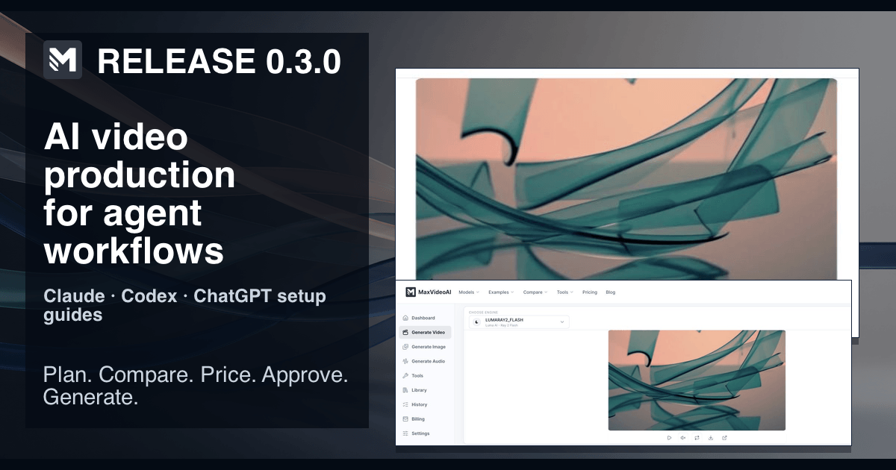

# MaxVideoAI GitHub release template

Use this only for a reviewed, releasable tag. Replace every bracketed field with current evidence; remove a section rather than guessing.

## Outcome

**Short answer:** [State the production or package outcome in one evidence-qualified sentence.]



*Current MaxVideoAI product proof; it does not prove native host installation or end-to-end host validation.*

## What changed

- [Reviewed package, documentation, or safety change.]
- [Link to the source diff or issue.]

## Who benefits

[Name the producer, developer, or administrator outcome. Do not imply every host or account is supported.]

## Current visual

**Asset:** `plugins/maxvideoai/assets/social/release-0.3.0.png`.

**Evidence boundary:** [State exactly what the visual proves and what it does not prove.]

## Install or update

Use the reviewed release tag, not a guessed version:

```sh
codex plugin marketplace add camgraphe/MaxVideoAi --ref <reviewed-release-tag>
codex plugin add maxvideoai@maxvideoai
```

Then start a new Codex task and use `$plan` for a no-spend comparison. Command availability varies by host build; check the [Codex guide](../../plugins/maxvideoai/docs/codex.md) for the current boundary.

## Compatibility

[List only a recorded client/version and the cited evidence. State “unverified” where evidence is absent. Protocol support, a package install, and a native-host generation are separate claims.]

## Safety boundary

Planning and project budgets do not authorize paid work. A prepared request returns an exact quote; only explicit approval authorizes one paid attempt. Recover an accepted job before considering another request. Do not include tokens, passwords, private media, or account data in release evidence.

## Full changelog

- [Added]
- [Changed]
- [Fixed]
- [Security or documentation note]

## Sources and publication gate

- Reviewed source tag: [URL]
- Checksum asset: [URL and SHA-256]
- Platform guidance: https://maxvideoai.com/docs/mcp
- Publication gate: source tag, checksums, clean install, current visual provenance, compatibility wording, safety boundary, and support links reviewed by the release owner.
