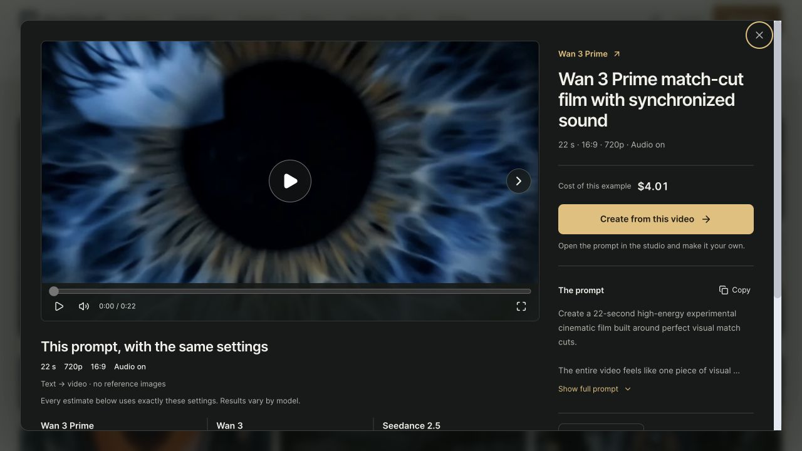

# Video discovery acceptance — 28 September 2026

Measured application candidate `611597f62`, compared with main `add7b773b`. Gallery measurements use `7c6294177`; changes up to the measured candidate are confined to the reader and its direct-route preparation. Earlier reader measurements remain in the JSON as diagnostic evidence with their own application SHA/build ID. The warm portrait performance gate remains open; PR #363 is a draft. No production migration, merge or deployment was performed.

### Subsequent model-menu refinement

The gallery model menu now stays on one row with native horizontal scrolling and overflow arrows. Its links remain server-rendered; a small client component observes the edges, respects reduced motion and reveals the active model. Browser checks at 390 and 1440 px cover pointer/keyboard scrolling to the last model, selected-family visibility, no horizontal page overflow and hidden controls when everything fits. Ten route contracts, focused lint and TypeScript pass. This later gallery change is **not included in the Lighthouse measurements below**; the portrait verification gate remains open.

## Prepared-build measurements

Both builds use the same 120-video public snapshot in a disposable, socket-only PostgreSQL database, with read-only application connections and the same public GA4 configuration. One synthetic approved editorial entry exercises the existing canonical slug and VideoObject behavior. Dataset hash and build IDs are in [measurements.json](measurements.json).

Lighthouse 12.6.1, Chrome 153, DevTools CPU ×4/network throttling; desktop 1350×940/DPR1, mobile 412×823/DPR1.75. Optimized image server caches were verified HIT on both builds. Cold visits use fresh browser profiles; warm visits use one separate profile per version/surface/device, one excluded seed and two retained visits. Cold sets contain three alternating visits per version. Warm optimized images and stylesheets must be confirmed from disk cache in the DevTools logs. No consent is set in the profiles. No agent-started competing build/test/video playback runs during measurement.

Values below are median and observed range, not field percentiles. Navigation Lighthouse does not measure field INP or overlay opening latency.

An earlier landscape warm run had long wall-clock gaps after four audits: Lighthouse total runtime was 925–1,011 s while the recorded traces spanned 12.7–19.1 s. Its portrait extension also contained a baseline warning about incomplete results, a 1,004 s total runtime and CPU benchmark index 1,795 versus about 3,750 normally. Those groups remain as diagnostic evidence and do not establish a warm gain. A subsequent preannounced warm group completed but contained slower candidate desktop/portrait results; it is discussed below, not discarded as noise. The first final-candidate cold group failed on its sixth audit (page stopped responding); it is incomplete and its warm group never started. The last preannounced rerun produced every report but includes the portrait warning detailed below. It uses fresh profiles, the same seeds, alternating visits and throttling, with `caffeinate -is` attached only to the benchmark process. No lock or global power setting was changed. All completed-group individual values, warnings, benchmark indices, runtime totals and earlier trace spans are preserved in the JSON.

### Cold browser cache

| Surface | LCP before, s (range) | LCP candidate, s (range) | CLS candidate | TBT before → candidate, ms | Media before → candidate, KiB |
|---|---:|---:|---:|---:|---:|
| watch-desktop | 1.849 (1.847–1.851) | 1.841 (1.840–1.846) | 0.0000 | 23.5 → 12.5 | 0.0 → 0.0 |
| watch-mobile | 1.848 (1.833–1.848) | 1.837 (1.833–1.849) | 0.0000 | 25.3 → 15.6 | 0.0 → 0.0 |
| gallery-desktop | 1.960 (1.957–1.966) | 1.898 (1.895–1.908) | 0.0000 | 28.1 → 27.5 | 60.3 → 202.2 |
| gallery-mobile | 1.909 (1.899–1.910) | 1.897 (1.896–1.906) | 0.0000 | 30.9 → 31.2 | 0.0 → 60.3 |

### Warm browser cache

| Surface | LCP before, s (range) | LCP candidate, s (range) | CLS candidate | TBT before → candidate, ms | Media before → candidate, KiB |
|---|---:|---:|---:|---:|---:|
| gallery-desktop | 0.943 (0.943–0.943) | 0.928 (0.921–0.934) | 0.0000 | 0.0 → 12.4 | 0.0 → 0.0 |
| gallery-mobile | 0.920 (0.910–0.929) | 0.918 (0.907–0.930) | 0.0000 | 0.0 → 0.0 | 0.0 → 0.0 |
| watch-desktop | 0.848 (0.846–0.850) | 0.856 (0.798–0.914) | 0.0000 | 2.8 → 5.2 | 0.0 → 0.0 |
| watch-mobile | 0.852 (0.821–0.884) | 0.803 (0.779–0.826) | 0.0002 | 4.9 → 0.0 | 0.0 → 0.0 |

### Visual completion and image transfers

These are observed transfers during navigation, not complete site weights. Speed Index is not a Core Web Vital; its regression remains a real tradeoff of this presentation.

| Cache / surface | Speed Index before → candidate, ms | Images before → candidate, KiB | Images + media before → candidate, KiB |
|---|---:|---:|---:|
| Cold / gallery-desktop | 3116 → 4031 | 135.0 → 361.8 | 195.3 → 564.0 |
| Cold / gallery-mobile | 2142 → 3606 | 153.0 → 278.8 | 153.0 → 339.0 |
| Warm / gallery-desktop | 1380 → 2289 | 1.2 → 0.2 | 1.2 → 0.2 |
| Warm / gallery-mobile | 872 → 2203 | 0.2 → 0.2 | 0.2 → 0.2 |
| Cold / watch-desktop | 1874 → 1860 | 27.9 → 57.8 | 27.9 → 57.8 |
| Cold / watch-mobile | 1894 → 1848 | 30.4 → 97.3 | 30.4 → 97.3 |
| Warm / watch-desktop | 838 → 880 | 1.2 → 1.2 | 1.2 → 1.2 |
| Warm / watch-mobile | 842 → 823 | 0.2 → 0.2 | 0.2 → 0.2 |

## Measured candidate interpretation and remaining gate

**PR #363 remains a draft. The final gallery and both landscape/portrait readers now require a complete comparison in a stable isolated environment after functional stabilization.** Later model-menu and pricing changes are outside the measured commits. The following results describe those measured commits only. Functional checks, the production build, Quality CI and Vercel pass for application commit `611597f62`. Final cold landscape measurements and warm landscape cells completed normally. The final warm portrait comparison is not conclusive, so performance acceptance is not marked complete.

The final cold group has 12 audits without warnings or runtime errors, CPU benchmark indices 3,821.5–3,862.5 and total runtimes 25.1–27.0 s. Candidate CLS is zero in all six visits. LCP differences are small (desktop −7.6 ms and mobile −11.7 ms median); these do not establish a broad speed improvement. Watch image transfers increase from 28,581 to 59,159 bytes on desktop and 31,175 to 99,667 bytes on mobile. No video bytes transfer before Play.

The warm landscape cells contain two retained visits per version/device. Their eight retained audits complete in 17.9–18.7 s without warnings, with benchmark indices 3,828.5–3,846.5. Optimized images and all external stylesheets come from disk cache. Desktop LCP is 850.153→913.890 ms on one pair and 846.331→797.974 ms on the other: opposite directions, median 848.242→855.932 ms. This supports neither a repeatable desktop gain nor equivalence. Desktop FCP increases from 674.6 to 735.2 ms median, and Speed Index from 837.5 to 880.5 ms; those costs remain visible. Landscape mobile LCP is 852.084→802.633 ms median. Candidate CLS stays below 0.00035 across these visits; the earlier 0.096735 prompt jump is not reproduced.

The final portrait candidate's second retained audit has a **929.9 s total runtime and an explicit warning that results may be incomplete**, despite an exit code of zero, disk-cache proof and a benchmark index of 3,839. Its computed LCP must not be used to claim a portrait gain. The full portrait cell, including its attractive 932.084→801.114 ms median, is retained only as diagnostic evidence in the JSON and omitted from the accepted tables above. No individual visit is silently dropped or substituted. A complete reliable portrait comparison remains required before clearing this performance gate; repeated host/browser interruptions are documented rather than hidden by another favorable subset.

The gallery costs below remain a separate design tradeoff: more posters and bounded animated previews, stable critical LCP in these local runs, but higher image/media transfers and slower secondary visual completion. Field INP, production TTFB and Google indexing are not established here.

## Interpretation and loading tradeoffs

The initial candidate introduced a repeatable ~90 ms watch LCP regression with the same 18,935-byte poster. Earlier HTML/server preload hints did not reach production response headers before Next's stylesheet hints. The inline fix removes the extra reader stylesheet request: four external stylesheets match baseline. Its 43 scoped class mappings and declarations were strictly preserved in `7c6294177`; the later mobile-order correction is described below. A single inline style is present with the watch reader or dialog (including loading/error), and absent from the initial gallery. The Core Web task independently reviewed the inline change and found no actionable issue. The 14,429-byte uncompressed style text now travels in HTML/JS rather than as separately cacheable CSS; those bytes have not disappeared.

The first warm group subsequently exposed one mobile CLS of 0.096735 (the other retained visit was zero). The prompt moved about 550 px because a later streamed comparison block was placed before it by CSS order. Lighthouse deliberately includes shifts following its initial viewport emulation; `had_recent_input=true` is not a reason to discard this result. Commit `0c139fbb4` puts mobile comparisons after prompt/reference/share content, following the landscape DOM order. The dark desktop presentation is unchanged. Earlier warm LCP medians were 814.465→846.861 ms desktop and 778.868→827.753 ms mobile; overlapping ranges do not establish equivalence.

The complete `order-warm-reader-clean` group still showed unfavorable desktop and portrait comparisons: median LCP 966.8→1,102.1 ms desktop, 1,032.2→1,011.0 ms landscape mobile and 871.0→931.6 ms portrait; portrait TBT 12.2→127.7 ms. CPU benchmark indices varied from 1,181.5 to 1,858.5, but both desktop pairs and both portrait pairs were slower on the candidate. One desktop pair had similar benchmark indices (1,181.5/1,226) and a 117 ms LCP increase. Its cached poster's render delay grew 288.6→365.5 ms and pre-LCP layout 68.8→125.8 ms. These observations remain adverse evidence; variable host load does not justify dropping them. The traces indicate later parsing/layout, not proof of a particular server await duration.

Commit `611597f62` reuses the direct route's already validated editorial/source-image signals instead of reading them again. The fresh API reader keeps its own eligibility checks. It also emits the same scoped inline CSS before the asynchronous marketing shell: style offset moves from 137,929 to 6,963, ahead of the header. The existing marketing wrapper and both CSS imports remain. Prepared HTTP checks verify 308 for approved ID→slug, 404 for unknown IDs and 200 for the canonical route for both Chrome and Googlebot user agents. The direct reader has one inline style; the initial gallery has none. The Core Web task reviewed these changes without an actionable finding. Only the final-candidate groups in the tables establish the final local measurements; earlier cold reader results are not reused.

The gallery deliberately shows more visual content and allows up to three desktop short previews and one mobile preview, compared with one/zero previously. Cold observed video transfers rise from about 60 to 202 KiB on desktop and 0 to 60 KiB on mobile. Poster transfers and Speed Index also rise with the denser, animated gallery. Those costs are included in the raw measurements; this is not a claim that every aspect of loading improved. Full originals are reserved for requested playback, and no watch video bytes transfer before Play. Reduced motion, Save-Data, visibility and the global pause control continue to restrict previews.

Cold gallery Speed Index worsens by 915 ms desktop and 1,464 ms mobile, with non-overlapping before/after ranges. Observed images plus media grow about 2.89× desktop and 2.22× mobile. Inspection of the run-zero filmstrips confirms both secondary-poster loading and animation: the candidate's main poster is visible at 2.44 s desktop / 2.63 s mobile while secondary frames are still empty; those frames are filled in the 4.89 s / 3.95 s captures. Later frames continue changing with playback. These sparse screenshots bound the observation rather than give exact poster completion times, and the SI difference cannot be dismissed as animation alone. See [filmstrip-review.png](filmstrip-review.png).

## Functional acceptance

Prepared-build shared reader, opened above the retained gallery:

- 6,208 non-browser tests pass, 2 skip, 0 fail. Three pre-existing browser automation suites were excluded locally; product interactions were verified through the browser separately.
- Frontend lint/TypeScript, exposure, registry, SEO machine checks, public renditions and immutable home-poster checks pass. Both production builds pass. Existing Supabase Edge Runtime process.version warnings occur in both builds.
- 513 eligible fixture videos traverse 22 pages without missing/duplicate IDs. Count/order/eligibility precede SQL paging; hydration remains page-sized. Existing schemas and configured empty collections retain their contracts.
- Prepared browser: 24 gallery links, page 2 continuation, previous across a page boundary, Back restoring page/filter/opener, Forward reopening and refresh rendering the same title as a direct H1. Approved IDs redirect to their existing canonical slug.
- First Play completed the 22-second original at 1280×720. Copy reports success. Next switches to the portrait video, retains dialog focus, and Escape restores the gallery. Gallery previews are absent while the dialog is open. Desktop 1440/mobile 390 do not overflow horizontally.
- Canonical/robots/hreflang and VideoObject comparisons pass on `/examples`, page 2, `/examples/wan` and the approved watch route. FR/ES localhost redirect loops reproduce on both baseline and candidate, so those full localized HTTP paths remain a local verification limit; localization contracts pass.
- Persisted admin SEO changes feed the same popup/direct title, prompt and context. Successful writes invalidate ID/current/previous slug and sitemap paths; failed/rejected writes do not. Disabled editorial entries leave the public reader available without sitemap eligibility. Deleted media is excluded by both fresh readers.
- Independent whole-branch review found two Important issues, both reproduced and fixed: focus after Next/retry and deleted-source eligibility on direct watch pages. Later targeted styles/data reviews found no actionable issue and the Core Web task confirmed the mobile streaming-order cause. GitHub Quality CI and Vercel pass on final application commit `611597f62`; the initial CI failure was two stale admin label expectations, corrected without weakening the assertion.

## Decisions and practical limits

- Homepage readers retain explicit request scopes and their independent batching/cache contract. Their regression tests compare fresh scopes; catalog tests own complete ordering and totals. This separate homepage behavior does not cap public gallery pagination.
- Opening slots are optional and separately selected from ordinary ordering. They count within the 24-card page. Only complete compatible 16:9/9:16/16:9/16:9 sets form an opening; otherwise native-format rows remain. Additive migration 53 was applied only to disposable tests, and is required to enable new admin opening configuration in production.
- One SSR gallery tree uses CSS geometry. No viewport-dependent JavaScript packing, duplicate hero or repeated page-one opening on later pages.
- Comparison estimates use explicit per-proposal duration, resolution, aspect and audio in a text-to-video scenario without references. Three distinct executable models are selected by closest duration, then format/resolution/audio, preferring different canonical prices within the closest duration group. Adaptations are highlighted. These estimates do not claim equivalent output quality. Generation requotes.
- Native history preserves the existing watch route while the gallery stays mounted. A minor remains: popup history initially uses `/video/id`; Share uses the approved canonical slug and direct entry redirects to it.
- Authenticated local browser composition was unavailable. Actual hook DOM tests cover exact settings, login return URLs, deliberate second choices and protection of user edits; no production login smoke claim is made.
- New admin SEO writes invalidate affected routes. Other existing publication writers may retain their previous cache-freshness delay; their behavior was not broadly rewritten.
- This fixture does not establish production TTFB, field INP, Google indexing, consented analytics behavior or physical-device fullscreen behavior. Production release must follow the repository PR/CI/deployment guide and its migration gate.

## Local evidence

Raw reports, network logs, traces, screenshot evidence, fixture script and SQL are retained under `.reports/video-discovery-2026-09-28/` in the implementation worktree. `performance/measure.py` and the two Lighthouse config files reproduce the runs against the matching built commits and fixture. `measurements.json` preserves individual retained/seed values, cache proof, environment and variability for remote review. Incomplete and unsuccessful experiments are explicitly excluded.

### Later comparison coverage change

The reader now selects three nearest executable configurations, retaining duration first and displaying each proposal’s settings. This change is later than the Lighthouse evidence above and is not covered by those measurements. The local 120-video public snapshot returned three canonical quotes per video, all with the original duration; that is functional coverage, not a performance or live pricing override measurement. The remaining performance gate covers the final gallery and both landscape and portrait readers, including cold/warm conditions. Run the complete comparison after the functional lot stabilizes, in a stable isolated environment; do not restart the interrupted Lighthouse loop on this host.
