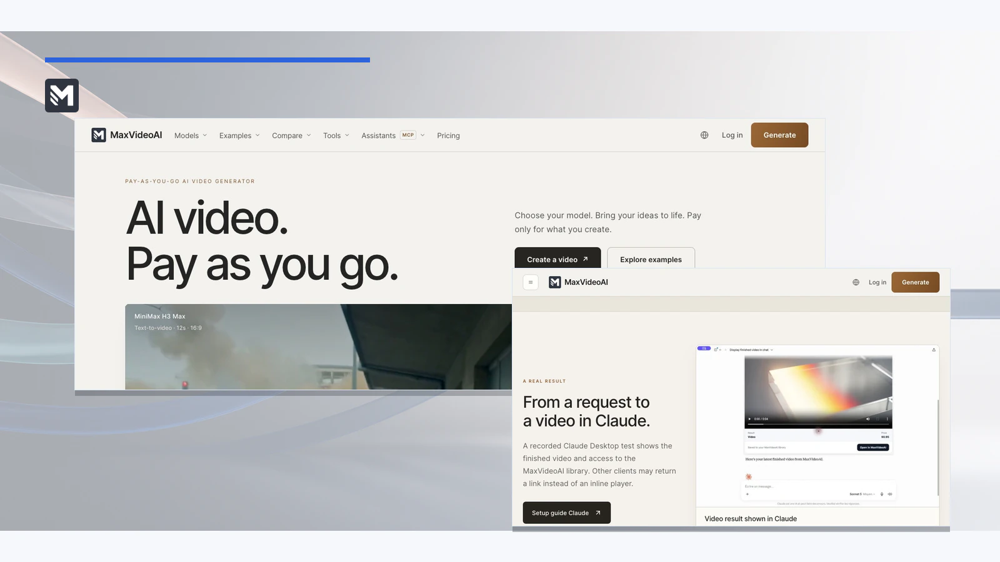
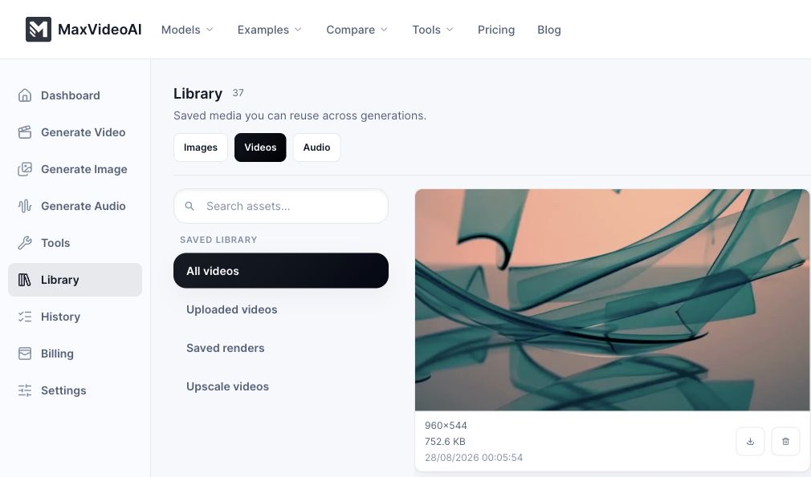

# MaxVideoAI for Claude, ChatGPT or Codex

MaxVideoAI is a multi-model AI video production service exposed through a remote MCP server and packaged for agent workflows. Bring a brief, compare current models, see the exact price, approve one paid attempt, generate, then recover the finished result in the MaxVideoAI Library—without turning production into a chain of disconnected tabs.

**Plan. Compare. Price. Approve. Generate.**

Setup guides: [Claude](docs/claude.md) · [ChatGPT](docs/chatgpt.md) · [Codex](docs/codex.md) — see [current compatibility evidence](https://maxvideoai.com/docs/mcp).



*Current MaxVideoAI product proof. The editorial layer is decorative; this is not native Claude, ChatGPT, or Codex host proof.*

### Start with the repository-validated Codex package path

```sh
codex plugin marketplace add camgraphe/MaxVideoAi --ref maxvideoai-plugin-v0.3.2
codex plugin add maxvideoai@maxvideoai
```

Start a new Codex task, then ask `$maxvideoai:plan` to compare AI video models or `$maxvideoai:generate` to prepare a concrete request. The first live MaxVideoAI action opens OAuth in your browser so you can sign in or create the account you want to connect. These commands validate the checked-in package path; they are not a claim of external marketplace approval.

## Bring private references into the conversation

ChatGPT imports authorized attachments and generated files as private assets. Compatible ChatGPT or Claude surfaces accept up to eight ordered files in-chat; Codex and Claude Code use the local helper. No public URL or Computer Use is needed. Files stay in the private MaxVideoAI Library; single-use links expire automatically.



*Real Library continuity proof. This capture does not claim that an in-chat file import was exercised.*

## Choose your setup

- [Claude connector setup](docs/claude.md) — add the remote MCP URL from Claude's connector settings and complete OAuth.
- [ChatGPT setup](docs/chatgpt.md) — install the shared plugin after public-directory approval, or use the developer MCP URL fallback.
- [Codex plugin setup](docs/codex.md) — install the tagged package, start a new task, and invoke `$maxvideoai:plan` or `$maxvideoai:generate`.
- [Generic remote MCP setup](docs/generic-mcp.md) — connect a client that explicitly supports remote Streamable HTTP and OAuth.

Every route connects to `https://api.maxvideoai.com/mcp`. Add the URL exactly as written: no token, query string, password, or API key. Host availability and permissions can change, so use the guide for your surface before connecting.

**Example**: Connect the endpoint, complete OAuth, then ask for a no-spend model plan before testing generation.

## What changes for a producer?

**Live model choice.** Ask for current model facts and comparable, named production budgets before spending credits. MaxVideoAI reads the live catalogue instead of shipping a copied model list or static prices.

**Reviewed prompting guidance, grounded in live product truth.** When a reviewed official provider prompting guide is available for the selected model, the assistant can use it to shape a stronger request. MaxVideoAI's live model details still remain authoritative for current capabilities, settings, availability, and pricing.

**An exact-price approval boundary.** A project budget helps you choose a direction. A prepared generation returns the exact quote for the selected model and settings. Nothing is submitted as paid work until you explicitly approve that quote. One approval authorizes exactly one paid attempt.

**Recovery with Library continuity.** If a response is interrupted after submission, check the accepted job before doing anything new. Recover the completed result or refunded outcome without creating a duplicate paid attempt. Private references and completed work remain in the connected MaxVideoAI Library.

## How does the workflow stay clear?


1. **Plan:** turn the brief into current model options and comparable named budgets. Planning does not spend credits.
2. **Prepare:** validate the concrete request, selected settings, and supported private references.
3. **Price:** receive the exact quote for that request.
4. **Approve:** authorize exactly one paid attempt with an explicit confirmation.
5. **Generate and recover:** follow the accepted job, then present or recover its result from the MaxVideoAI Library.

The composite above proves a completed MaxVideoAI result continuing into the Library. It does not depict a verified brief, quote, approval, or native host flow. See [how the two workflows divide responsibility](docs/how-it-works.md).

## How do you compare current AI video models?

In Codex, use `$maxvideoai:plan` before committing to a production route. In Claude Code, use `/maxvideoai:plan`. The planning skill can recommend current executable options for each shot, explain trade-offs, and calculate comparable named budgets without authorizing generation.


The image shows MaxVideoAI product selection and a completed result; it is not quote, approval, or budget proof. Live planning responses remain authoritative for current model capabilities, availability, and project estimates.

**Example**: “Compare current AI video models for a 20-second product film. Give me a quality-first plan and a lower-cost plan, but do not prepare a paid generation.”

## How do exact quotes, approval, and result recovery work?

In Codex, use `$maxvideoai:generate` when the request is concrete. In Claude Code, use `/maxvideoai:generate`. MaxVideoAI prepares the selected model, prompt, settings, and supported references, then returns an exact quote. You stay in control of the spend: an ambiguous reply is not approval, and an approval cannot silently authorize a second attempt.


This current production capture proves MaxVideoAI workspace-to-Library continuity. It is not native host recovery proof. When a conversation drops after submission, ask for the accepted job's status or recent generations before considering new paid work. A refunded attempt closes that authorization; a replacement needs a fresh quote and new approval.

## Try asking

**Example**: “Plan three shots for a cinematic launch film and compare current model options.”

- “Build comparable budgets for one consistent model and a deliberate model mix.”
- “Use my existing product image as the first frame where the selected workflow supports it.”
- “Prepare the exact quote, but do not generate until I clearly approve it.”
- “Check the accepted job before you consider another paid submission.”
- “Recover my completed result and point me to the same MaxVideoAI Library asset.”

## Four practical workflow examples

- [Compare current AI video models](examples/compare-ai-video-models.md) before selecting a route.
- [Price an AI video project](examples/price-a-video-project.md) from a shot list before preparing work.
- [Plan a Claude video-production request](examples/claude-video-production.md) with a no-spend validation prompt.
- [Run a Codex video-production workflow](examples/codex-video-production.md) from installation through recovery.

```text
Brief → no-spend plan → exact quote → explicit approval → one paid attempt → Library recovery
```

## What should you review before connecting?

Read [privacy and permissions](docs/privacy-and-permissions.md) for the plain-language account, media, and spending boundaries. For setup problems, interrupted responses, refunds, or reconnection, use [troubleshooting](docs/troubleshooting.md).

MaxVideoAI is free to connect and has no separate plugin subscription. Sign in or create a MaxVideoAI account during OAuth. Planning and project budgets do not spend credits; approved generations use existing MaxVideoAI credits on a pay-as-you-go basis.

Explore: [plan your assistant workflow](https://maxvideoai.com/mcp?utm_source=github&utm_medium=repository&utm_campaign=assistant_video_plugin&utm_content=hero_connect) · [compare current models](https://maxvideoai.com/models) · [review current pricing](https://maxvideoai.com/pricing?utm_source=github&utm_medium=repository&utm_campaign=assistant_video_plugin&utm_content=pricing) · [recover work in the MaxVideoAI Library](https://maxvideoai.com/app/library?utm_source=github&utm_medium=repository&utm_campaign=assistant_video_plugin&utm_content=library).

Policies and help: [privacy](https://maxvideoai.com/legal/privacy) · [terms](https://maxvideoai.com/legal/terms) · [contact support](https://maxvideoai.com/contact) · [security](SECURITY.md) · [Business Source License 1.1](LICENSE). You can also email [support@maxvideoai.com](mailto:support@maxvideoai.com).

Last reviewed: 2026-08-28.
